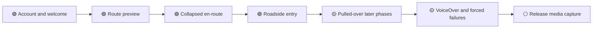

# App Hardening Impeccable Audit

**Date:** 2026-07-16
**Device used for runtime checks:** iPhone 17 Pro simulator, iOS 26.3
**Text sizes checked:** standard Large and AX5 (`accessibility-extra-extra-extra-large`)

## Verdict

The hardening work is visually stronger, but final portfolio capture must wait until the remaining release-capture gate is complete. Runtime checks found real accessibility failures that source review alone had missed: React Native was scaling type twice, fixed-height route and safety surfaces hid actions at AX5, and Settings lost its title and controls. Those failures are now fixed and guarded by tests.

The current evidence supports standard and AX5 layout for the main route preview, collapsed en-route navigation, Roadside entry, Pulled-over armed decision, Settings, and welcome/account entry. Expanded or later internal safety phases that could not be reached through simulator deep links are source- and test-backed, not claimed as runtime-verified.

## Evidence ledger

| Surface or state | Standard runtime | AX5 runtime | Source and tests | Verdict |
|---|---:|---:|---:|---|
| Welcome | Yes | Yes | Yes | Supported |
| Login and Get started | Earlier signed-out runtime; current auth guard prevents direct reopening | Source-only after latest error-card fix | Yes | Partially runtime-verified |
| Route preview | Yes | Yes | Yes | Supported |
| En-route collapsed | Yes | Yes | Yes | Supported |
| En-route expanded hazard or fuel details | Not interactively expanded | Not interactively expanded | Yes: variable details now scroll above pinned End Trip | Runtime interaction pending |
| Roadside problem picker | Yes | Yes | Yes | Supported |
| Roadside action/status steps | Earlier standard action capture | Not interactively advanced | Yes | Runtime interaction pending |
| Pulled-over armed decision | Yes | Yes | Yes | Supported |
| Pulled-over contact and Officer/Trooper review | Not interactively advanced | Not interactively advanced | Yes: scrollable; comparison stacks at accessibility sizes | Runtime interaction pending |
| Settings | Yes | Yes | Yes | Supported |
| Sign-out completion | Yes at standard size through the real flow | Direct deep link is blocked while authenticated | Yes | AX5 runtime pending |

## Closed findings

### P1: Dynamic Type was applied twice

React Native already scales rendered glyphs. `dynamicType()` also multiplied `fontSize`, so AX5 text grew twice and pushed critical controls offscreen.

- `theme/dynamic-type.ts` now leaves `fontSize` to React Native and scales only explicit line height.
- Fixed navigation chrome can use a maximum multiplier while long copy continues to use the full system scale.
- The matching guidance in `docs/learnings.md` now describes the actual behavior.

In lay terms: the app and iOS were both turning the same volume knob. The helper now adjusts only the spacing that iOS leaves behind.

### P1: Route and safety actions disappeared at AX5

- Route preview gets a definite large-text frame and a scrollable body.
- Destination names can use two lines and ETA text no longer shrinks below the requested size.
- Roadside headings and rows use bounded interface scaling, flexible rows, and scrolling.
- Pulled-over Armed is scrollable, answer cards use `minHeight`, and the first answer remains visible at AX5.
- Pulled-over Contact is scrollable. The Officer/Trooper comparison scrolls and switches from side-by-side to stacked at accessibility sizes.

### P1: En-route information could displace the exit

The expanded bottom sheet had a 65% height cap but no internal scroll. Hazard and fuel content could grow into End Trip.

- The cap now derives from `useWindowDimensions()` instead of a module-load snapshot.
- Variable ETA, fuel, and hazard content scrolls.
- End Trip stays outside that scroll region and remains pinned.

### P1: Settings became unusable at AX5

- Shared settings headers use bounded scaling and retain their full names.
- The profile identity card uses bounded scaling.
- Shared rows grow to two or three lines instead of clipping.
- Destructive text uses the readable `severityCritical` token on light cards.

### P1: Primary action labels failed contrast

White text on Fresh Green measured about 2.9:1. A border made the button boundary visible but did not make the words readable.

- Shared bright-green primary buttons now use black label text.
- Hand-rolled auth, Go, placement, Roadside, tow-call, and Pulled-over Continue actions use the same pairing, including busy indicators and the route-start arrow.
- Dark Wilted Green buttons retain white text.

### P1: Account consent and failures were unclear

- Privacy Policy and Terms and Conditions are real links to the legal screen and do not toggle the checkbox.
- Login and Get started failures render in a light error card with readable error text and alert/live-region semantics.

### P1: Safety-state copy overstated what the app knew

- Pulled-over now says no message or location has been sent and asks the user to call or text their trusted contact.
- Roadside now says `Call opened` after handing off to Phone and tells the user to confirm help directly with the provider.
- Location sharing is presented as an editable Messages draft. After handoff, the app says the draft opened and still needs to be sent. It never claims delivery or live sharing.

## Remaining gates before final media

1. Run the later Pulled-over and Roadside internal phases interactively on a device or simulator with working input control.
2. Trace VoiceOver focus and announcements for auth failure, route preparation, backup status, and sign-out completion.
3. Force corridor, storage, and weak-network failures to confirm their visible recovery states.
4. Build a Release capture binary. Final screenshots and video must not contain `Clear reports`, Moderation, dev sign-in, LogBox warnings, demo-route pills, or private names and locations.
5. Capture at native device resolution with a clean test identity and safe public route.

## Capture truthfulness rule

Final media should show only states the product can currently produce. Release builds automatically remove the `__DEV__`-gated Clear reports chip and developer login surfaces. `EXPO_PUBLIC_HIDE_MODERATION_ROW=true` removes the moderator row for the capture account. Demo or fallback route data must be visibly disclosed or avoided rather than presented as live evidence.
