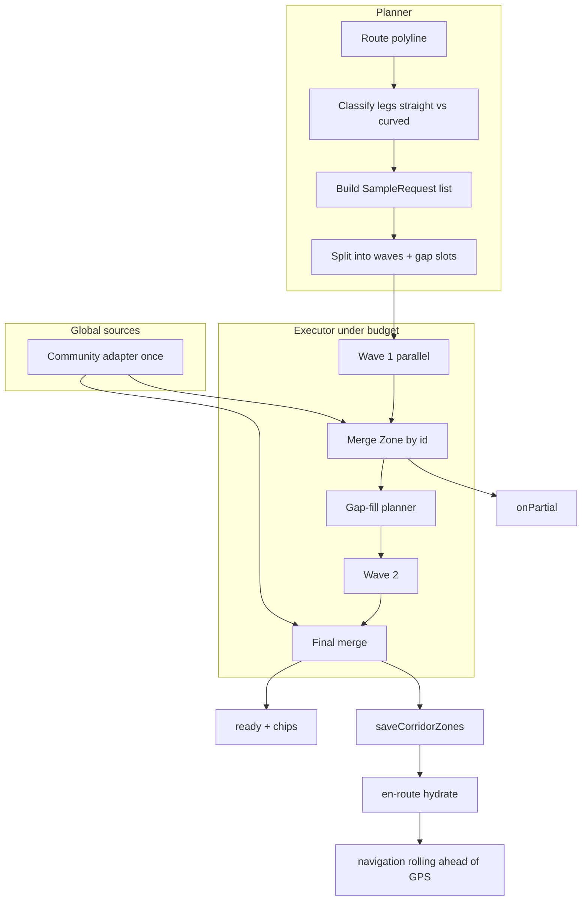
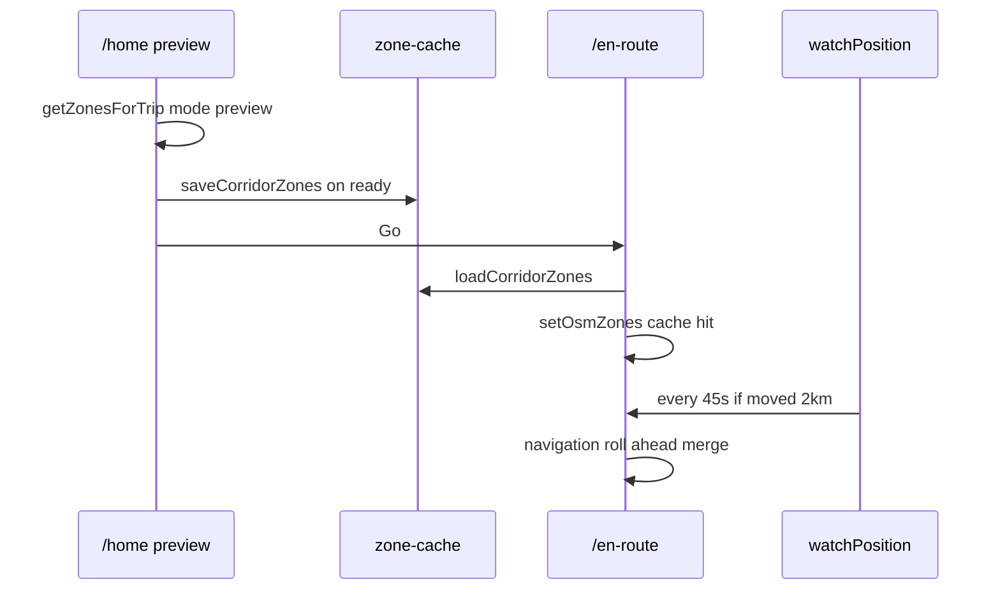

# Corridor sampling + multi-source zones — design

**Date:** 2026-06-04  
**Status:** Approved (brainstorm — option **B**: budgeted waves + gap-fill + straight-leg bbox from day one)  
**Scope:** Beyond thesis — product-grade corridor coverage, then richness adapters on the same plan/merge pipeline.

## Problem

Route-preview chips and scoring both depend on `enabledZones`, but zone
fetch today has structural limits:

1. **Long trips** cannot be covered by one Overpass bbox (timeout,
  element cap, useless diagonal area).
2. **Uniform `around` sampling** under-covers megatrips (e.g. 976 mi →
  a handful of 1.5–12 km circles on ~1% of the driven path).
3. **Earlier double-fetch** (origin→dest, then polyline refine) multiplied
  latency (~15s “Checking route…”).
4. **Simplified preview polylines** (`overview=simplified` for trips
  > 150 mi) miss hazards between sparse vertices unless intersection
  >  densifies the line.
5. **Richness gaps** (community sync, 511 incidents, extended OSM) have
  no single place to plug in without re-breaking load time.
6. **/en-route re-fetches the whole corridor** on mount today — duplicate
  Overpass work, preview chips and live drive can disagree, and megatrips
   still leave most miles unloaded even though GPS already tests zones
   locally (`enteredZoneIds`, `encounteredZonesRef`).

The user should see orange chips / All clear only after a **defined
corridor check** completes on **/home** — not while OSM is in flight, and
not from stale prior-trip data. **/en-route** should start from that same
merged set, then extend coverage **ahead of the car** while driving.

## Goals

### Sampling (Part A)

- **G1.** One orchestrated trip fetch: plan → execute under budget → merge.
- **G2.** **Wave 1** fast partial coverage; optional `onPartial` for /home.
- **G3.** **Gap-fill** on longest arcs with zero `routePassesZone` hits.
- **G4.** **Wave 2** for budget remainder: planned anchors + reactive
“hot leg” tighten + gap midpoints.
- **G5.** **Straight-leg bbox** from day one when bearing is stable ≥
`MIN_STRAIGHT_METERS` and cardinal-ish (reduce circles on interstates).
- **G6.** P95 loading chip **≤ ~10s** on cellular; hard caps on calls/time.
- **G7.** Honest copy on long trips (`LONG_TRIP_COPY_METERS`): checked **along
sampled stretches**, not every mile — required footnote + scoped a11y (see
Implementation knobs).

### En-route sampling (Part A2 — home base + rolling ahead)

- **G12.** **/home** corridor fetch is the **authoritative preview base**;
persist to device when `tripZonesStatus === 'ready'`.
- **G13.** **/en-route** **hydrates** from that cache on mount (instant
`osmZones` for scoring, markers, turn hazards) — no full re-plan at Go.
- **G14.** **Navigation mode:** while driving, fetch only **uncovered**
polyline ahead of GPS under a **small per-tick budget** (not a second
10s preview stall).
- **G15.** Live GPS continues to use **already-loaded** zones for
`enteredZoneIds`, turn hazards, trip-summary validation — rolling fetch
only **grows** the merged set.

### Data richness (Part B — phased on same pipeline)

- **G8.** `SampleRequest` lists **sources** so OSM, 511, community, etc.
share one executor (community still **full-line** once per trip).
- **G9.** Extended Overpass tags without new vendors (B0).
- **G10.** Community cloud adapter (B1) — device-agnostic reports.
- **G11.** State 511 adapter on bbox legs (B4) — demo-corridor states first.

## Non-goals

- Mile-by-mile guaranteed coverage on cross-country trips.
- Rotated / non-axis-aligned Overpass queries (Overpass limitation).
- Live police location feeds.
- Crime-spot commercial APIs.
- Offline tile CDN / precompute platform (north star only; not v1 of this spec).
- New chip types or park-on-chips (parks remain score-only).
- Changing `scoreRoute` weights or reserved-color rules (only inputs grow).

## Architecture

Three layers unchanged in spirit; **corridor execution** becomes explicit:

```text
lib/corridor/          constants.ts + planner + executor + navigation (NEW)
lib/api/zone-cache.ts  persist preview corridor zones (NEW, mirrors route-cache)
lib/api/sources/       per-vendor adapters → Zone[] (evolve from zones.ts)
lib/scoring.ts         routePassesZone, pickWinner (unchanged contract)
app/home.tsx           tripZonesStatus + onPartial → saveCorridorZones
app/en-route.tsx       loadCorridorZones → rolling navigation executor
```




## Part A — Corridor sampler (option B)

### Types

```typescript
/** Vendor slice requested for one spatial query. */
export type ZoneSourceId =
  | 'osm-overpass'
  // future: 'dot-511', 'mapbox-incidents', 'crash-corridor'

export type SampleRequest =
  | {
      kind: 'around';
      center: Coordinate;
      radiusMeters: number;
      sources: ZoneSourceId[];
      /** Planner metadata for wave-2 / logging */
      legId?: string;
    }
  | {
      kind: 'bbox';
      bounds: ZoneBounds;
      sources: ZoneSourceId[];
      legId?: string;
    };

export type FetchBudget = {
  maxMs: number;       // default 10_000
  maxCalls: number;    // default 16
  maxParallel: number; // default 8
};

export type CorridorFetchMeta = {
  wave: number;
  requestsDone: number;
  done: boolean;
};

/** How the corridor executor is invoked. */
export type CorridorMode =
  | 'preview'      // /home — full plan, waves, gap-fill, loading chip
  | 'navigation';  // /en-route — hydrate cache + rolling ahead-of-car only

export type GetZonesForTripOptions = {
  origin: Coordinate;
  destination: Coordinate;
  routeCoordinates?: Coordinate[];
  mode?: CorridorMode; // default 'preview'
  budget?: FetchBudget;
  onPartial?: (zones: Zone[], meta: CorridorFetchMeta) => void;
  /** Navigation only: live GPS + active route for uncovered-arc detection. */
  userLocation?: Coordinate | null;
};
```

### Leg classification (straight vs curved)

Pure function on the **same polyline** used for chips (`Route.coordinates`).

- Walk vertices; accumulate **straight run** length while
`|Δbearing| ≤ MAX_BEARING_DELTA_DEG` between consecutive segments.
- On breach: close run.
  - If run length ≥ `MIN_STRAIGHT_METERS` **and**
  mean bearing within `CARDINAL_TOLERANCE_DEG` of N/E/S/W → emit
  `**bbox`** for run vertices (+ padding), consuming planned circle
  slots for that span.
  - Else → emit `**around**` at bend (and short runs use wave-1 spacing).

**Constants (initial):**


| Constant                   | Value  | Rationale                         |
| -------------------------- | ------ | --------------------------------- |
| `MIN_STRAIGHT_METERS`      | 20_000 | ~12 mi stable highway before bbox |
| `MAX_BEARING_DELTA_DEG`    | 12°    | Per-segment tolerance             |
| `CARDINAL_TOLERANCE_DEG`   | 15°    | Skip diagonal fat boxes           |
| `BBOX_PAD_METERS`          | 2_000  | Perpendicular highway context     |
| `LONG_TRIP_METERS`         | 45_000 | Below: single trip bbox           |
| `WAVE1_ANCHOR_CAP`         | 8      | First paint budget                |
| `SEGMENT_TARGET_SPACING_M` | 70_000 | Fallback circle spacing           |
| `MAX_SEGMENT_ANCHORS`      | 20     | Hard plan cap                     |
| `SEGMENT_MAX_RADIUS_M`     | 12_000 | Mega-trip circles                 |
| `SEGMENT_TIMEOUT_MS`       | 8_000  | Per request                       |
| `GAP_ARC_METERS`           | 80_000 | Gap-fill chunk size               |
| `MAX_GAP_FILLS`            | 3      | Per trip                          |
| `HOT_LEG_ZONE_COUNT`       | 35     | Wave-2 tighten threshold          |
| `HOT_LEG_RADIUS_FACTOR`    | 0.5    | Second pass radius                |


### Planning algorithm (sketch)

```text
planCorridor(path, pathMeters):
  if pathMeters <= LONG_TRIP_METERS:
    return [ { kind: 'bbox', bounds: paddedBounds(path), sources: ['osm-overpass'] } ]

  legs = classifyLegs(path)
  requests = []
wr
  for leg in legs:
    if leg.kind === 'straight' && leg.cardinalEligible:
      requests.push({ kind: 'bbox', bounds: leg.bounds, sources })
    else:
      // defer to anchor spacing along leg polyline

  anchors = uniformAnchors(path, cap: WAVE1_ANCHOR_CAP)
  for anchor not covered by a bbox leg:
    requests.push({ kind: 'around', center: anchor, radius: corridorRadius(pathMeters) })

  wave1 = first N requests fitting WAVE1_ANCHOR_CAP + all bboxes (bboxes count as 1 call each)
  wave2 = remainder + reserved gap-fill slots (empty until after wave1 merge)

  return { wave1, wave2, pathMeters }
```

**Call accounting:** Each `SampleRequest` = 1 `maxCalls` unit. Bbox on a
200 mi leg replaces ~4 circles — net savings on interstate-heavy trips.

### Execution

```text
executePlan(plan, budget, onPartial):
  merged = new Map<id, Zone>()
  start = now()

  runWave(1):
    parallel batch (maxParallel) of fetchSample(request)
    merge into merged
    onPartial?.([...merged], { wave: 1, done: false })

  gapRequests = planGapFills(polyline, merged)  // routePassesZone per arc
  hotRequests = planHotLegTighten(wave1 results)

  runWave(2) while under budget:
    gap + hot + remaining plan requests

  if merged.empty: mock at path midpoint (trip-level only)

  onPartial?.([...merged], { wave: 2, done: true })
  return [...merged]
```

**Per-sample fetch (`fetchSample`):**

- `osm-overpass`: existing `buildOverpassQueryAround` / `buildOverpassQueryBbox`,
2 mirrors, `SEGMENT_TIMEOUT_MS`, no per-sample mock.
- Future sources: dispatch inside `fetchSample` by `sources[]`.

**Community reports:**

- **Not** per-sample. `appendCommunityZones(merged, routeCoordinates)` once
after wave 1 (or at end): load `getCommunityReportsAsZones()`, filter with
`routePassesZone` optional pre-merge (or merge all reports and let
scoring/chips filter — prefer merge all points, same as today).

### Intersection (scoring — confirm / extend)

Already shipped partial fix; spec codifies:

- **Point zones:** `isPointNearPolyline` on `**routePointsForZoneTest(polyline)`**
(densified, cap 400, ~300 m spacing).
- **Polygon / polyline:** `routePointsForZoneTest` + `isPointInZone`.

Optional follow-up (not blocking B): densify **only for `classifyLegs`**
if simplified polyline mis-classifies straights — measure on NYC→Birmingham.

### UI (`/home`)


| `tripZonesStatus` | Behavior                                    |
| ----------------- | ------------------------------------------- |
| `idle`            | No destination                              |
| `loading`         | Plan running; gray **Checking route…** chip |
| `ready`           | Final merge; orange chips or All clear      |


- On destination change: `setOsmZones([])`, `loading`.
- `getZonesForTrip({ ..., onPartial })` → `setOsmZones` each partial;
`pickWinner` / chips recompute via existing memos.
- `ready` only after executor finishes (wave 2 + gaps or budget exhausted).
- Long trip (`pathMeters > LONG_TRIP_COPY_METERS`): **required** footnote under
chips — *“Hazards checked along sampled stretches of this route.”* (see
**Implementation knobs → UX honesty**).
- On `ready`: `**saveCorridorZones(zones, destination, meta)`** (see Part A2).

## Part A2 — En-route: home base + navigation rolling

### Principle

**Fetching** zones and **detecting** zones are separate on /en-route today:

- **Fetch (today):** one `getZonesForTrip` at mount — same upfront corridor
problem as /home.
- **Detect (today):** `watchPositionAsync` → `isPointInZone(userLocation, zone)`
for extended pills, speed cluster, trip-summary `encounteredZonesRef`.

Part A2 keeps detect as-is and fixes fetch:

```text
/home preview  → full corridor plan (mode: preview) → cache write
/en-route mount → load cache → setOsmZones immediately
/en-route drive → mode: navigation → merge only uncovered arcs ahead of GPS
```

Preview remains **required** for route ranking and chips before Go. En-route
does **not** replace preview; it **inherits** preview and **extends** it.

### Corridor zone cache (`lib/api/zone-cache.ts`)

Mirror `lib/api/route-cache.ts` semantics:


| Field           | Purpose                                                        |
| --------------- | -------------------------------------------------------------- |
| `zones: Zone[]` | Final merged OSM (+ metadata for community handled separately) |
| `destination`   | Grid-rounded coordinate (~50 m, same as route cache)           |
| `pathMeters`    | Trip length at cache write                                     |
| `routeId`       | Optional: selected route id from preview                       |
| `cachedAt`      | TTL + stale UI                                                 |


**Key:** `gridKey(destination)` only — origin-agnostic (user has moved by Go).
**TTL:** 24 h (match route cache). Stale cache → navigation falls back to one
`preview` plan on mount (logged), same as cache miss.

**Write:** `/home` when `tripZonesStatus` becomes `ready` after
`getZonesForTrip({ mode: 'preview' })`.

**Read:** `/en-route` first line of zone load path — before any Overpass.

**Not in URL params** — zone payloads are too large for expo-router params;
AsyncStorage only (same constraint as routes).

**Community reports:** stay in `community-reports` adapter / `reportZones`
state on each screen — not duplicated in corridor cache (device-local,
refreshed on focus). Cache is **OSM corridor** from preview executor.

### /en-route mount sequence

```text
on mount (destLat/Lng set):
  zones = await loadCorridorZones(destination)

  if zones.length > 0:
    setOsmZones(zones)     // immediate scoring, enRouteZones, turn hazards
    navigationBase = zones
  else:
    // User opened /en-route without preview (deep link, unfamiliar flow)
    await getZonesForTrip({ mode: 'preview', ... })  // one-shot full plan
    setOsmZones(result)
    saveCorridorZones(result, destination)

  // routes: existing getRoutesBetween (full detail) — unchanged
  // NO second full preview plan if cache hit
```

Aligns with existing Go params (`destRouteRank`, primed ETA) — zones now
follow the same “prime from /home” pattern as route metadata.

### Navigation mode (rolling ahead-of-car)

Runs **after** GPS subscription is live, on a **throttled** schedule (not
every 1 s tick):


| Constant               | Value                                           | Rationale                                             |
| ---------------------- | ----------------------------------------------- | ----------------------------------------------------- |
| `NAV_ROLL_INTERVAL_MS` | 45_000                                          | At most ~1 roll burst per 45 s while moving           |
| `NAV_MIN_MOVE_METERS`  | 2_000                                           | Skip if parked / GPS noise                            |
| `NAV_AHEAD_METERS`     | 30_000                                          | Fetch corridor ~18 mi ahead along **active** polyline |
| `NAV_BUDGET`           | `{ maxCalls: 2, maxMs: 6_000, maxParallel: 2 }` | Small burst                                           |
| `NAV_AROUND_RADIUS_M`  | 3_000                                           | Tighter than preview mega-trip 12 km                  |


**Uncovered arc detection:**

1. Project `userLocation` onto `activeRoute.coordinates` → `distanceAlong` m.
2. Mark corridor “covered” from preview cache: arcs where
  `routePassesZone` hit **or** sample centroid within `NAV_AHEAD_METERS` of
   a prior navigation fetch (track `fetchedAlong: [startM, endM][]`).
3. If `distanceAlong + NAV_AHEAD_METERS` extends into an arc with no coverage
  → plan 1–2 `around` samples at `aheadPoint` (+ optional straight-leg
   `bbox` if classifyLegs on the **local** polyline slice qualifies).
4. `fetchSample` → merge into `navigationBase` by zone id → `setOsmZones`.

**No loading chip on /en-route.** Silent merge; optional dev log
`[corridor] navigation +N zones`. MapKit marker flicker accepted (same
trade as today's zone-arrival on first fetch).

**Scoring on /en-route:** `pickWinner` runs once when `rawRoutes` resolve;
active route usually fixed after user picks rank. Rolling merge updates
`enabledZones` for **turn hazards**, **enteredZoneIds**, **validatableZones**
— does not re-rank mid-drive unless we explicitly add that (non-goal for v1).




### Mode summary


| Surface             | `CorridorMode`                    | Budget                  | UI                      |
| ------------------- | --------------------------------- | ----------------------- | ----------------------- |
| /home browse        | N/A — `getZonesForRegion`         | —                       | —                       |
| /home + destination | `preview`                         | 10s / 16 calls          | Checking route… → chips |
| /en-route mount     | cache read; miss → `preview` once | same as preview on miss | none                    |
| /en-route driving   | `navigation`                      | 6s / 2 calls per roll   | none                    |


### What en-route does *not* do (v1)

- Re-run full trip plan on every GPS tick.
- Replace preview fetch on /home.
- Pass zones through router params.
- Re-run `pickWinner` on every navigation merge (optional v2).

### Migration from current `zones.ts`

- Move trip orchestration to `lib/corridor/executor.ts` + `planner.ts`.
- `getZonesForTrip` becomes thin wrapper (backward-compatible signature).
- `getZonesForRegion(center)` unchanged for browse mode.
- Delete duplicate full `getZonesForTrip` on every /en-route mount when cache hits.
- Add `lib/api/zone-cache.ts` + `lib/corridor/navigation.ts` (rolling planner).

## Part B — Richness adapters (phased)

Same `SampleRequest.sources`; executor fan-out.

**Implementation plan:** [2026-06-04-corridor-data-richness.md](../plans/2026-06-04-corridor-data-richness.md) (B0→B1→B4→B5 tasks). Cross-source merge: **Part B½** below.


| Phase  | Deliverable                                                      | Sampling interaction                               |
| ------ | ---------------------------------------------------------------- | -------------------------------------------------- |
| **B0** | Extended Overpass selectors in `osm-overpass`                    | All around/bbox requests                           |
| **B1** | `community-cloud.ts` + Supabase (or Firebase)                    | Once per trip + line test                          |
| **B2** | Corridor sampler (Part A) + zone cache + navigation rolling (A2) | Preview + /en-route                                |
| **B3** | (included in B) straight-leg bbox                                | Planner                                            |
| **B4** | `dot-511.ts` — AL + peer states along demo route                 | `sources` includes `dot-511` on **bbox** legs only |
| **B5** | `mapbox-incidents.ts`                                            | When `routeSource === 'mapbox'`                    |
| **B6** | TIGER / crash GIS offline join                                   | Bbox legs or pre-tiled; post-demo                  |


**511 adapter shape (B4 sketch):**

```typescript
// lib/api/sources/dot-511.ts
export async function fetchZonesForBbox(
  bounds: ZoneBounds,
  stateCode: string,
): Promise<Zone[]>  // category road-condition, type caution|avoid
```

Planner adds `'dot-511'` to `sources` when leg’s dominant state is in
`SUPPORTED_511_STATES` and request is `bbox`.

**Community (B1):** Replace AsyncStorage read in trip path with sync’d
adapter; local offline queue still writes to device, syncs up — out of
scope for B2 PR, but types reserved.

## Part B½ — Hazard identity & cross-source merge

**Status:** Draft (2026-06-04) — implement with **B4** (first non-OSM corridor
source). B0–B1 may ship without this; vendor-prefixed `id` strings are
required from day one so later merge logic has stable keys.

### Problem

The corridor executor already dedupes by `zone.id` (`Map<string, Zone>`,
last write wins). That collapses **the same OSM element** returned from
overlapping `around` samples (`osm-way-12345`). It does **not** collapse:

- The same real-world incident from **511 + OSM construction** on one mile.
- **Mapbox incident + 511** closure on the same interchange.
- **Two OSM features** on one road (e.g. `lit=no` polyline + `surface=gravel`
  polyline) — usually intentional (different chip buckets).
- **Community report + OSM police** at the same block — different semantics
  (human observation vs infrastructure tag); not auto-merged.

Without a cross-source rule, B4/B5 inflate **chip counts**, **scoreRoute**
inputs, and map geometry for one hazard.

### Three merge layers (do not conflate)

| Layer | When | Key | Today |
| ----- | ---- | --- | ----- |
| **L1 — Vendor identity** | Every adapter output | `zone.id` (namespaced) | `osm-way-${osmId}`, `osm-node-${osmId}` |
| **L2 — Sample overlap** | Corridor / nav merge | Same as L1 | `mergeZones` in `executor.ts` |
| **L3 — Hazard equivalence** | After L2, before UI count / optional score dedup | `canonicalHazardKey` | **Not implemented** (B4 PR) |

L1/L2 stay as-is. L3 is new and scoped to **same chip bucket + same place +
same time window** — not “merge all police” globally.

### `Zone` shape (additive)

```typescript
export type ZoneSourceId =
  | 'osm-overpass'
  | 'dot-511'
  | 'mapbox-incidents'
  | 'community-report'   // screen path only; not in corridor cache
  // future: 'crash-corridor'

export type Zone = {
  id: string;                    // L1 — unique per vendor record
  source: ZoneSourceId;          // NEW — who produced this zone
  canonicalHazardKey?: string;   // NEW — L3; adapter MAY set; merge fills if absent
  // ... existing type, label, geometry, coordinates, category, report* fields
};
```

**`id` namespace (required for every adapter):**

| Source | `id` pattern | Example |
| ------ | ------------ | ------- |
| OSM | `osm-way-${id}` / `osm-node-${id}` | unchanged |
| 511 | `511-${state}-${vendorId}` | `511-al-closure-88421` |
| Mapbox | `mapbox-inc-${incidentId}` | `mapbox-inc-abc123` |
| Community | `report-${reportId}` | unchanged |

Never reuse a bare numeric id across vendors.

### `canonicalHazardKey` (L3)

Stable string for “one hazard the user should count once.” Adapters **may**
set it; `lib/corridor/merge-hazards.ts` (new) **computes** it when missing
before zones reach chips/score.

**Default key material** (v1 — conservative, tunable in constants):

```text
canonicalHazardKey =
  `${hazardBucket}:${gridLat}:${gridLng}`
```

Where:

- `hazardBucket` — derived from `category` + `type` (see table below).
- `gridLat` / `gridLng` — anchor coordinate snapped to
  `HAZARD_GRID_METERS` (default **250 m**), same spirit as
  `ZONE_CACHE_GRID_METERS` but coarser (highway-scale, not destination key).

**Anchor coordinate by geometry:**

| Geometry | Anchor |
| -------- | ------ |
| `point` | The point |
| `polyline` | Midpoint of path (or first coord if 2-point) |
| `polygon` | Centroid of bbox (cheap; not survey-grade) |

**`hazardBucket` mapping (chip-aligned):**

| `category` | `type` | `hazardBucket` |
| ---------- | ------ | -------------- |
| `lighting` | `avoid` / `caution` | `low-light` |
| `police` | `caution` | `police` |
| `wildlife` | `caution` | `wildlife` |
| `road-condition` | `caution` / `avoid` | `road` |
| `community-report` | (any non-safe) | `community` |
| `landuse` / `park` | — | **no key** (score-only; not route-preview chips) |
| `safe` | `safe` | **no key** (excluded from hazard dedup) |

Zones with no `hazardBucket` skip L3 — they still merge on L1 only.

**Optional v2:** append time bucket for live feeds (`:${YYYYMMDD}` from
511/Mapbox `startsAt`) so stale closure doesn’t suppress a new one. v1
omits time — acceptable for thesis demo if feeds refresh per trip fetch.

### Equivalence predicate

Two zones are **the same hazard** iff:

1. Both resolve to the same `canonicalHazardKey` (after computation), **and**
2. Both have the same `hazardBucket`.

Community reports use bucket `community` only — they never equivalence-merge
with `police` / `road` / `low-light` (orange eye vs yellow teardrop stays).

### Merge precedence (when L3 collides)

When multiple zones share a `canonicalHazardKey`, **one survivor** enters
`enabledZones` for chip **counts** and `scoreRoute`. Map overlay may still
show all geometries in v2; **v1: single survivor everywhere** (simpler).

| Priority (high wins) | Source | Rationale |
| -------------------- | ------ | --------- |
| 1 | `community-report` | Human flag is never silently dropped by infra |
| 2 | `dot-511` | Live authority for closures/incidents on demo corridor |
| 3 | `mapbox-incidents` | Live traffic layer when routing is Mapbox |
| 4 | `osm-overpass` | Static/tag baseline |

**Field merge on collision:** keep winner’s `id`, `source`, `geometry`,
`coordinates`, `type`; set `label` to winner’s label; optional
`alsoReportedBy: ZoneSourceId[]` in dev logs only (not UI v1).

### Where L3 runs

```text
fetchSample(sources[]) → per-source Zone[]
  → mergeZones (L1/L2 by id)           // executor.ts — unchanged
  → collapseByCanonicalKey (L3)      // NEW — after each wave batch + final return
  → onPartial / cache / screens
```

**Community:** still merged **once per trip** outside corridor samples
(`appendCommunityZones` / `reportZones` on screen). L3 runs on
`[...osmMerged, ...communityZones]` only at the **home/en-route enabledZones**
boundary — not inside OSM-only `zone-cache` (cache stays OSM-only per
`COMMUNITY_IN_CORRIDOR_CACHE`).

### UI & scoring contract

| Consumer | Rule |
| -------- | ---- |
| **`routeHazardChips` (/home)** | Count **distinct `canonicalHazardKey`** per `RouteHazardType`, not raw zone rows. Fallback: if key absent, count by `id` (B0–B3 behavior). |
| **`routeConditions` (compare sheet)** | Unchanged — presence per condition type (already deduped). |
| **`scoreRoute`** | v1: score against **post-L3** zone list (no double penalty for 511+OSM). Document in learnings if weights shift on demo route. |
| **Yellow hazard markers** | v1: one marker per distinct key (same cap-6 policy); snap still via `nearestPointOnPolyline`. |
| **Community eye pins** | Never collapsed with OSM; separate layer. |

### Constants (add with B4)

| Knob | Default | Notes |
| ---- | ------- | ----- |
| `HAZARD_GRID_METERS` | `250` | Equivalence grid; tune on NYC→Birmingham QA |
| `HAZARD_MERGE_ENABLED` | `true` | Kill-switch for L3 without removing adapters |
| `HAZARD_MERGE_LOG_COLLISIONS` | `__DEV__` only | Log winner/loser source pairs |

### Phasing

| Phase | L3 work |
| ----- | ------- |
| **B0** | OSM ids only; no L3 |
| **B1** | Cloud community ids; **no** auto-merge with OSM |
| **B4** | Ship `merge-hazards.ts` + `source` field + 511 ids; enable L3 for `road` bucket first |
| **B5** | Extend precedence table; Mapbox ids |
| **B6** | Optional offline keys; likely separate bucket |

### Non-goals (v1)

- Merging **different** chip buckets at the same grid cell (lit=no + police
  station) — user should see both signals.
- Sub-250 m precision for duplicate detection (would need segment overlap
  math — deferred).
- Deduplicating **recommendations** (`samePlace`) — separate module; do not
  reuse name+proximity for hazards without a spec change.
- Hiding community because OSM has `amenity=police` nearby.

### Test plan (add to corridor QA when B4 ships)

1. Mock 511 closure + OSM `highway=construction` on same bbox → **one**
   `road` chip count, survivor `dot-511`.
2. OSM speed camera + OSM `amenity=police` 300 m apart → **two** `police`
   counts (different keys).
3. Community report + OSM police at same coords → **community chip + police
   chip** (or community + eye pin), not collapsed.
4. Overlapping corridor samples returning same `osm-way-id` → still one zone
   (L1 unchanged).

## Approaches considered


| Approach                                 | Verdict                |
| ---------------------------------------- | ---------------------- |
| A — Waves + circles only                 | Rejected; user chose B |
| **B — Waves + gap-fill + straight bbox** | **Selected**           |
| C — Waves first, bbox later              | Rejected               |
| Tile precompute platform                 | Deferred north star    |


## Implementation knobs

All tunables live in `**lib/corridor/constants.ts`** (single source of truth).
Screens pass `**FetchBudget` overrides** only for tests or dev menus — not
inline magic numbers. `planner.ts` / `executor.ts` / `navigation.ts` import
from constants; `zone-cache.ts` imports TTL/key knobs only.

Type shape for grouped exports (implementation convenience):

```typescript
export const corridorKnobs = {
  preview: { /* FetchBudget + wave/gap/hot */ },
  navigation: { /* roll + ahead */ },
  classify: { /* leg bbox */ },
  intersection: { /* routePassesZone — re-export from scoring or shared */ },
  cache: { /* zone-cache */ },
  ux: { /* footnote + a11y scope */ },
} as const;
```

### Preview budget (`FetchBudget`)

Default passed by `getZonesForTrip({ mode: 'preview' })` from `/home`.


| Knob                         | Default  | Tune up when…                                        | Tune down when…                             |
| ---------------------------- | -------- | ---------------------------------------------------- | ------------------------------------------- |
| `PREVIEW_BUDGET.maxMs`       | `10_000` | Megatrip still sparse after other knobs; QA on Wi‑Fi | P95 loading >10s on cellular; Overpass 504s |
| `PREVIEW_BUDGET.maxCalls`    | `16`     | Need more wave-2 / gap-fill slots                    | Rate limits; mirror failures                |
| `PREVIEW_BUDGET.maxParallel` | `8`      | Slow mirrors but stable network                      | Overpass overload; flaky LTE                |


**Presets** (dev-only or `__DEV__` menu — do not ship alternate defaults to prod
without measuring):


| Preset         | maxMs  | maxCalls | maxParallel | Use                                |
| -------------- | ------ | -------- | ----------- | ---------------------------------- |
| `default`      | 10_000 | 16       | 8           | Production                         |
| `aggressive`   | 14_000 | 24       | 8           | QA megatrip; thesis demo recording |
| `conservative` | 8_000  | 12       | 6           | Degraded network testing           |


Wave accounting: each `SampleRequest` = 1 call; **bboxes count as 1** (same as
circles). Executor stops when **either** `maxMs` or `maxCalls` is exhausted.

### Trip shape & short-trip fast path


| Knob                             | Default  | Effect if ↑                                  | Effect if ↓                                          |
| -------------------------------- | -------- | -------------------------------------------- | ---------------------------------------------------- |
| `LONG_TRIP_METERS`               | `45_000` | Fewer single-bbox trips                      | More trips use wave planner                          |
| `WAVE1_ANCHOR_CAP`               | `8`      | Richer first `onPartial` paint               | Slower wave 1; fewer wave-2 slots                    |
| `MAX_SEGMENT_ANCHORS`            | `20`     | Larger plan (capped by budget)               | Fewer planned circles                                |
| `SEGMENT_TARGET_SPACING_M`       | `70_000` | Fewer, wider-spaced anchors                  | More anchors on same path length                     |
| `SEGMENT_MAX_RADIUS_M`           | `12_000` | Wider OSM catch per circle                   | Smaller queries; may miss offset hazards             |
| `SEGMENT_MIN_RADIUS_M`           | `1_500`  | —                                            | Floor for `corridorRadius()` (today’s browse radius) |
| `CORRIDOR_RADIUS_SPACING_FACTOR` | `0.4`    | Larger radius = `min(MAX, spacing × factor)` | Tighter circles                                      |


`corridorRadius(pathMeters)` (implement in `planner.ts`):

```text
anchorCount = min(MAX_SEGMENT_ANCHORS, max(8, ceil(pathMeters / SEGMENT_TARGET_SPACING_M)))
spacing = pathMeters / anchorCount
return clamp(SEGMENT_MIN_RADIUS_M, spacing * CORRIDOR_RADIUS_SPACING_FACTOR, SEGMENT_MAX_RADIUS_M)
```

### Leg classification (straight → bbox)


| Knob                     | Default  | Effect if ↑                         | Effect if ↓                                  |
| ------------------------ | -------- | ----------------------------------- | -------------------------------------------- |
| `MIN_STRAIGHT_METERS`    | `20_000` | Fewer bbox legs (harder to qualify) | More bbox on shorter “straight” runs         |
| `MAX_BEARING_DELTA_DEG`  | `12`     | More runs classified straight       | More circles at gentle curves                |
| `CARDINAL_TOLERANCE_DEG` | `15`     | More diagonal bboxes (waste)        | Fewer bboxes; more circles on NE/SW highways |
| `BBOX_PAD_METERS`        | `2_000`  | Wider strip perpendicular to leg    | Thinner corridor; cheaper bbox               |


**Planner input polyline:**


| Knob                              | Default | Notes                                                                                                                                                                                                  |
| --------------------------------- | ------- | ------------------------------------------------------------------------------------------------------------------------------------------------------------------------------------------------------ |
| `CLASSIFY_USE_DENSIFIED_POLYLINE` | `false` | If `true`, run `classifyLegs` on `routePointsForZoneTest(polyline)` (same caps as scoring). Enable after NYC→Birmingham QA if simplified overview mis-bboxes. Chips still use raw `Route.coordinates`. |


### Gap-fill & hot-leg (wave 2)


| Knob                       | Default  | Effect if ↑                                                      | Effect if ↓                        |
| -------------------------- | -------- | ---------------------------------------------------------------- | ---------------------------------- |
| `GAP_ARC_METERS`           | `80_000` | Smaller gap chunks (more precise midpoints)                      | Fewer gap requests per arc         |
| `MAX_GAP_FILLS`            | `3`      | More hole-punching                                               | Faster finish; more uncovered arcs |
| `GAP_MIN_UNCOVERED_METERS` | `60_000` | Only fill arcs longer than this with zero `routePassesZone` hits | More gap-fill triggers             |
| `HOT_LEG_ZONE_COUNT`       | `35`     | Harder to qualify as “hot”                                       | More wave-2 tighten passes         |
| `HOT_LEG_RADIUS_FACTOR`    | `0.5`    | Tighter re-sample around dense leg                               | Wider second pass                  |


**Gap-fill trigger:** partition polyline into arcs of `GAP_ARC_METERS`; for each
arc where merged zones yield **zero** `routePassesZone` hits on
`routePointsForZoneTest(slice)`, enqueue one `around` at arc midpoint (radius =
`corridorRadius(pathMeters)`), until `MAX_GAP_FILLS` or budget exhausted.

### Overpass transport


| Knob                    | Default | Notes                                                                         |
| ----------------------- | ------- | ----------------------------------------------------------------------------- |
| `SEGMENT_TIMEOUT_MS`    | `8_000` | Per `fetchSample`; mirrors tried in order                                     |
| `OVERPASS_MIRROR_COUNT` | `2`     | First N of `OVERPASS_ENDPOINTS` in `zones.ts`                                 |
| `TRIP_MOCK_ON_EMPTY`    | `true`  | Single midpoint mock only if **entire** trip merge empty (dev/empty corridor) |


### Navigation rolling (`mode: 'navigation'`)

Separate budget object — **not** merged into `PREVIEW_BUDGET`.


| Knob                         | Default  | Tune up when…                              | Tune down when…                  |
| ---------------------------- | -------- | ------------------------------------------ | -------------------------------- |
| `NAV_BUDGET.maxMs`           | `6_000`  | Rolls time out before merge                | Faster ticks; less work per roll |
| `NAV_BUDGET.maxCalls`        | `2`      | Ahead corridor still bare at highway speed | Battery / rate limits            |
| `NAV_BUDGET.maxParallel`     | `2`      | —                                          | Serial only                      |
| `NAV_ROLL_INTERVAL_MS`       | `45_000` | More frequent ahead coverage               | Less network use                 |
| `NAV_MIN_MOVE_METERS`        | `2_000`  | Skip rolls when creeping in traffic        | Rolls while barely moving        |
| `NAV_AHEAD_METERS`           | `30_000` | Earlier hazard load before user arrives    | Smaller fetches                  |
| `NAV_AROUND_RADIUS_M`        | `3_000`  | Wider ahead sample                         | Cheaper queries                  |
| `NAV_ROLL_WHEN_BACKGROUNDED` | `false`  | Keep fetching in background (battery cost) | Pause rolls when app inactive    |


**Uncovered arc:** track `fetchedAlong: { startM, endM }[]` per navigation merge;
arc is covered if any prior preview/navigation sample centroid lies within
`NAV_AHEAD_METERS` of a point on that arc **or** `routePassesZone` hit on slice.

### Zone cache (`lib/api/zone-cache.ts`)


| Knob                               | Default            | Notes                                                                                                                                                                                                                                       |
| ---------------------------------- | ------------------ | ------------------------------------------------------------------------------------------------------------------------------------------------------------------------------------------------------------------------------------------- |
| `ZONE_CACHE_TTL_MS`                | `86_400_000` (24h) | Match `route-cache.ts`                                                                                                                                                                                                                      |
| `ZONE_CACHE_GRID_METERS`           | `50`               | Same rounding as route cache destination key                                                                                                                                                                                                |
| `ZONE_CACHE_KEY_INCLUDES_ROUTE_ID` | `false`            | If `true`, key = `grid(dest) + routeId` — avoids stale zones when user switches alternate on /home. **v1:** `false` + **always `saveCorridorZones` on each preview `ready`** (overwrites). Flip to `true` if alternate-switch bugs persist. |


### Intersection (scoring contract — already in `lib/scoring.ts`)

Document here so corridor and chips stay aligned; **do not duplicate** logic.


| Knob                          | Default | Location     |
| ----------------------------- | ------- | ------------ |
| `ROUTE_ZONE_TEST_SPACING_M`   | `300`   | `scoring.ts` |
| `ROUTE_ZONE_TEST_MAX_SAMPLES` | `400`   | `scoring.ts` |


Corridor planner does **not** change these unless we explicitly decide chip
intersection should be looser/tighter than scoring (non-goal).

### UX honesty (expectation management)


| Knob                       | Default                                                    | Where used                                                             |
| -------------------------- | ---------------------------------------------------------- | ---------------------------------------------------------------------- |
| `LONG_TRIP_COPY_METERS`    | `250_000` (~155 mi)                                        | `/home` footnote + scoped a11y when `pathMeters` exceeds               |
| `LONG_TRIP_FOOTNOTE_COPY`  | `"Hazards checked along sampled stretches of this route."` | `app/home.tsx` under chip row                                          |
| `ALL_CLEAR_A11Y_LONG_TRIP` | `"No hazards found in checked areas along this route."`    | Replaces absolute “along this route” when footnote visible             |
| `PARTIAL_DEBOUNCE_MS`      | `0`                                                        | `0` = immediate partial chips; `300` = coalesce `onPartial` UI updates |


Optional v2 (not v1): show planner meta under footnote —
`"Checked {requestsDone} areas · {pathMiles} mi route"` from
`CorridorFetchMeta` + `pathMeters`.

### Community & global sources


| Knob                          | Default | Notes                                                                                              |
| ----------------------------- | ------- | -------------------------------------------------------------------------------------------------- |
| `COMMUNITY_MERGE_AFTER_WAVE`  | `1`     | `appendCommunityZones` after wave 1 partial (or `2` if only at end — prefer `1` for earlier chips) |
| `COMMUNITY_IN_CORRIDOR_CACHE` | `false` | Reports stay screen-local; cache OSM only                                                          |


### Wiring checklist (who reads which knob)


| Consumer                     | Knobs                                                               |
| ---------------------------- | ------------------------------------------------------------------- |
| `lib/corridor/planner.ts`    | Trip shape, classify, gap/hot thresholds, `corridorRadius`          |
| `lib/corridor/executor.ts`   | `PREVIEW_BUDGET`, Overpass transport, gap-fill execution, wave caps |
| `lib/corridor/merge-hazards.ts` | L3 collapse (B4+); `HAZARD_*` knobs |
| `lib/corridor/navigation.ts` | Navigation table + `NAV_ROLL_WHEN_BACKGROUNDED`                     |
| `lib/api/zones.ts`           | Thin wrapper; default `PREVIEW_BUDGET` only                         |
| `lib/api/zone-cache.ts`      | Cache table                                                         |
| `app/home.tsx`               | UX honesty, `PARTIAL_DEBOUNCE_MS`, passes `onPartial`               |
| `app/en-route.tsx`           | Navigation roll schedule; cache read/write path                     |


### Tuning workflow (QA)

1. **Canonical route:** NYC → Birmingham, AL (or longest thesis demo).
2. Log per trip: `{ pathMeters, requestsDone, waves, gapFills, durationMs, zoneCount }` behind `__DEV__`.
3. If **loading >10s** → lower `maxCalls` / `maxParallel` or `SEGMENT_TIMEOUT_MS` first.
4. If **sparse chips with OSM known on corridor** → raise `maxCalls` or `MAX_GAP_FILLS` one step; then try `aggressive` preset on Wi‑Fi only.
5. If **false bbox on mountain diagonal** → tighten `CARDINAL_TOLERANCE_DEG` or enable `CLASSIFY_USE_DENSIFIED_POLYLINE`.
6. If **Go stall** → cache miss path; verify `saveCorridorZones` on `ready`.
7. If **mid-drive misses ahead** → `NAV_AHEAD_METERS` / `NAV_BUDGET.maxCalls` before preview budget.

## Risks & mitigations


| Risk                                   | Mitigation                                             |
| -------------------------------------- | ------------------------------------------------------ |
| Simplified polyline mis-bbox           | Cardinal gate; optional densify-for-classify; gap-fill |
| Diagonal bbox waste                    | Cardinal tolerance; prefer circles                     |
| Overpass rate limit                    | `maxCalls`, `maxParallel`, 8s timeout                  |
| Chips churn on partial                 | Acceptable; or debounce partial UI 300ms               |
| 511 fragmentation                      | State registry; unsupported → OSM only                 |
| Cross-source duplicate hazards (B4+)   | L3 `canonicalHazardKey` + merge precedence (Part B½)   |
| Scoring shift mid-partial              | Document; alternates may re-rank — desired             |
| Cache miss at Go                       | One preview plan on /en-route mount; then save         |
| Stale cache (24h)                      | Full preview refresh on mount; warn in dev             |
| Navigation + preview disagree slightly | Same merge-by-id rules; navigation only adds           |


## Test plan

1. **Short trip** (<45 km): single bbox, <3s, chips match prior behavior.
2. **Regional** (~100 mi): wave1 only, no mock, ≥0 chips when OSM tagged.
3. **Megatrip** (NYC→Birmingham or 976 mi): loading ≤10s typical; not All clear
  at 2s; more than community-only when OSM exists on corridor.
4. **Straight interstate leg:** planner emits bbox; call count < uniform circles.
5. **Gap-fill:** synthetic sparse zones — midpoint request fires.
6. **Hot leg:** mock dense OSM in one sample → wave-2 tighten requests logged.
7. **Cancel destination mid-fetch:** cancelled flag; no stale `ready`.
8. **browse mode:** no trip sampler; `getZonesForRegion` unchanged.
9. **Go → en-route:** cache hit → `osmZones` populated before /en-route Overpass;
  turn hazards work on first GPS fix.
10. **Megatrip simulation:** drive progress into uncovered arc → navigation roll
  fires (dev log / zone count increases); no second 10s stall at Go.
11. **Cache miss path:** open /en-route without /home preview → one preview plan,
  then save cache.

## Implementation plan (PR sequence)

1. `**lib/corridor/constants.ts`** — all knobs from **Implementation knobs**
  (export `corridorKnobs` + named constants).
2. `**lib/corridor/planner.ts`** — leg classify + plan; unit-test pure planner
  on fixture polylines.
3. `**lib/corridor/executor.ts**` — waves, budget, merge, gap-fill, hot-leg;
  `mode: 'preview'`; wire `osm-overpass` fetches.
4. `**lib/api/zone-cache.ts**` — `saveCorridorZones` / `loadCorridorZones` /
  `clearCorridorZones` (optional, for sign-out / dev).
5. `**lib/corridor/navigation.ts**` — uncovered-arc detection + rolling
  `SampleRequest` plan; `mode: 'navigation'` branch in executor.
6. `**lib/api/zones.ts**` — delegate `getZonesForTrip` to executor; keep exports.
7. `**app/home.tsx**` — `onPartial`, footnote (`LONG_TRIP_COPY_METERS`),
  `saveCorridorZones` on `ready`.
8. `**app/en-route.tsx**` — hydrate cache on mount; throttled navigation roll
  off `userLocation` + `activeRoute`; remove redundant full fetch on cache hit.
9. **Docs:** `docs/learnings.md` entry after merge.
10. **B0/B1/B4** — separate PRs per phase table.

## Success criteria

- User-visible: long-trip preview no longer “one community flag only” when
OSM hazards exist on the sampled corridor.
- Developer-visible: new source = add adapter + `ZoneSourceId` + planner
rule — not a third parallel fetch path in screens.
- Loading chip never yields All clear before `ready`.
- Go → en-route: zones available immediately when preview completed; no duplicate
full corridor fetch on cache hit.
- Long-trip drive: zone set grows ahead of car without blocking UI.

## Open questions (resolve in implementation PRs)

Defaults for 2–5 are set in **Implementation knobs**; change only with QA evidence.

1. **Demo route canonical** for manual QA — NYC → Birmingham, AL (locked for tuning workflow).
2. ~~Partial debounce~~ → `PARTIAL_DEBOUNCE_MS` default `0`; try `300` if chip flicker annoys.
3. ~~`classifyLegs` input~~ → `CLASSIFY_USE_DENSIFIED_POLYLINE` default `false`.
4. ~~Navigation roll while backgrounded~~ → `NAV_ROLL_WHEN_BACKGROUNDED` default `false`.
5. ~~Cache on alternate switch~~ → re-save on every `ready`; optional `ZONE_CACHE_KEY_INCLUDES_ROUTE_ID`.

---

*Implementation plan:* [docs/superpowers/plans/2026-06-04-corridor-sampling.md](../plans/2026-06-04-corridor-sampling.md)