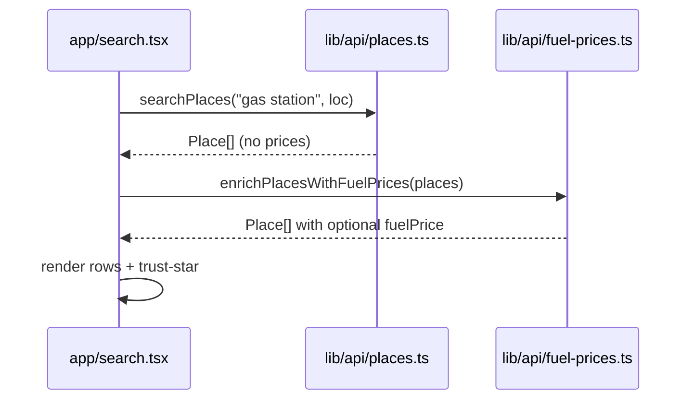

# Gas Search Prices — Design Spec

**Date:** 2026-06-04  
**Status:** Draft — ready for review (brainstorm complete; implementation plan not started)  
**Register:** product (app UI + adapter)  
**Supersedes (partially):** `2026-05-30-refuel-reminders-design.md` §Out of scope — "Fuel price / brand data" (that slice deferred refuel v1; this spec scopes a **narrow** price display for Gas search + on-route fuel rows only).

## Summary

Show **per-station regular-grade price** on Gas quick-tool search results and on-route fuel rows when we have a value — without crowding the row, without inventing live prices the thesis stack cannot source today. Prices are **additive metadata** on `Place`; distance + trust-star remain primary. When no price exists, the row looks exactly as it does now.

## Thesis connection

Refuel reminders already answer *when* to stop; prices answer *which stop is less punishing* — a practical Green Book–adjacent signal (trusted station + affordable fuel) layered on safety-first routing. Prices must **not** change route scoring or safety weights.

## Problem statement

| Surface | Today | User expectation |
|---------|--------|------------------|
| `/search` Gas results | Name, address, distance, trust-star | Optional `$3.49` (or similar) beside distance |
| `FuelStopsSheet` / fuel pins | Same `Place` shape via `searchPlaces` | Same price line when available |
| Data | Mapbox Search Box → `Place` has no price fields | Needs a second data path or honest mock |

Prior decision (refuel v1): omit prices to avoid clutter + no API. Re-opening is justified only with a **bounded contract**: optional field, omit when missing, no fake "live" label on demo data.

## Goals

1. **Readable at a glance** — one short price string per row (e.g. `$3.49 regular`), not a price table.
2. **Honest** — demo/mock prices are labeled in copy or env-gated; never implied real-time without a live provider.
3. **Low clutter** — price is `caption1` / tertiary, after address or paired with distance; Gas-only (not Food/Parking).
4. **Shared shape** — extend `Place` once; `searchPlaces` + `useRouteFuelStops` consumers pick it up automatically.
5. **Adapter pattern** — `lib/api/fuel-prices.ts` with mock fallback (same family as `zones.ts`, `places.ts`).

## Non-goals

- Route scoring / detour suggestions based on price.
- Diesel vs midgrade vs premium matrix (regular only in v1).
- Historical fill-up log, brand loyalty, or price alerts.
- Prices on Home browse recs (`priceTier` on restaurants stays separate).
- Guaranteed nationwide live coverage in thesis build.

## Approaches considered

### A — Mock-only adapter (recommended for thesis v1)

`lookupFuelPrices(places: Place[]): Promise<Map<string, FuelPriceQuote>>` keyed by Mapbox `id`.

- **Pros:** Zero new API keys, deterministic demo, works offline, matches existing mock-fallback culture.
- **Cons:** Not real; must disclose (settings footnote or `source: 'demo'` in dev menu).
- **Implementation:** Hash `place.id` → stable price in a band (e.g. $3.19–$4.29); `fetchedAt` = build time or session time.

### B — Live provider behind proxy (v2 / portfolio stretch)

New `proxy/api/fuel-prices` route calling a commercial or government feed (OPIS, GasBuddy partner API, etc.), keyed by lat/lng.

- **Pros:** Real prices where coverage exists.
- **Cons:** Cost, ToS, rate limits, sparse rural coverage, another secret in `.env.local`, honesty copy still needed for misses.
- **Thesis:** slot the interface in A; ship B only if a key exists before defense.

### C — Google Places `priceLevel` on gas POIs

Reuse enrichment proxy that already maps `priceLevel` → `priceTier` (`$$`) for recs.

- **Pros:** Infrastructure exists in `proxy/lib/google-places.ts`.
- **Cons:** **Not per-gallon** — restaurant-style tier is wrong semantic for Gas rows; would mislead ("$$" ≠ $3.49). **Rejected** for this feature.

**Recommendation:** **A now**, **B-ready interface** (`FuelPriceQuote.source: 'demo' | 'live'`).

## Architecture

### 1. Types — `lib/api/fuel-prices.ts` (new)

```ts
export type FuelPriceQuote = {
  /** Display string — "$3.49" (no "regular" in the number; copy adds grade). */
  display: string;
  /** Grade label for a11y / optional suffix — default "regular". */
  grade: 'regular';
  /** ISO when the quote was produced. */
  fetchedAt: string;
  source: 'demo' | 'live';
};

/** Map place.id → quote. Missing id = no price row (omit UI). */
export async function enrichPlacesWithFuelPrices(
  places: Place[],
  opts?: { mode?: 'demo' | 'live' },
): Promise<Place[]>;
```

### 2. Extend `Place` — `lib/api/places.ts`

```ts
export type Place = {
  // ...existing fields...
  /** Present only after fuel-price enrichment; Gas/charging contexts only. */
  fuelPrice?: FuelPriceQuote;
};
```

`searchPlaces` **does not** call enrichment internally (keeps geocoder single-purpose). Callers that need prices compose:

```ts
const places = await searchPlaces(query, loc);
const withPrices = await enrichPlacesWithFuelPrices(places);
```

### 3. Call sites (v1)

| Caller | When to enrich |
|--------|----------------|
| `app/search.tsx` | `phase === 'results'` && `selectedToolId === 'gas'` only |
| `hooks/useRouteFuelStops.ts` | After `searchPlaces` + route filter, before `setState` |
| `FuelStopsSheet` rows | Render `fuelPrice.display` if set (reuse search row pattern) |

Do **not** enrich Food/Parking/Saved/Recent paths.

### 4. UI — search result row (`app/search.tsx`)

**Layout (Gas only):**

```
[Name — body emphasized]
[Address — footnote, 1 line]
[$3.49 regular · 0.4 mi away]  ← caption1, labelTertiary; OR split:
  [$3.49 regular]     [0.4 mi]   [★]
```

**Recommendation:** Single tertiary meta line: **`$3.49 regular · 0.4 mi`** left of the trust-star; drop separate right-aligned distance column on Gas rows only to avoid three trailing columns. Food/Parking keep current distance-right layout.

**Accessibility:** `accessibilityLabel` appends `, $3.49 regular` when present.

**Honesty — demo mode:** When `source === 'demo'`, optional one-time footnote under results header (footnote, `labelTertiary`):

> *Sample fuel prices for demo — not live pump data.*

Gate with `__DEV__` or `EXPO_PUBLIC_FUEL_PRICE_MODE=demo` (default demo). Hide footnote when `live` and at least one quote returned.

### 5. UI — `FuelStopsSheet`

Add to existing `rowMeta` when `item.fuelPrice`:

- Was: `{distance} mi from you · along your route`
- Becomes: `$3.49 regular · {distance} mi from you · along your route` (omit price segment when missing)

### 6. Electric (`fuelType === 'electric'`)

**Out of scope for v1.** Mapbox "ev charging" rarely has kWh price in our pipeline. Sheet title stays "Charging on your route"; no `$` line. Revisit when a charging-price source is chosen.

## Data flow



Same enrichment step inside `useRouteFuelStops` after on-route filter.

## Demo price algorithm (deterministic)

- Input: `place.id` string.
- Hash to integer → map to cents in `[319, 429]` for regular.
- Format: `$X.XX` using locale `en-US`.
- `fetchedAt`: `new Date().toISOString()` at enrich time (label as sample in footnote, not "updated 2m ago" in v1 — avoids fake freshness).

## Edge cases

| Case | Behavior |
|------|----------|
| Enrichment fails | Return input places unchanged; no price lines; no error banner (prices are optional). |
| Partial map | Some rows show price, some don't — OK. |
| Trust-star + price | Star remains trailing; price in meta line does not shrink star hit target. |
| Long station name | Existing `numberOfLines={1}` on name unchanged. |
| User toggles Gas off mid-results | Clear enrichment state or ignore prices when `selectedToolId !== 'gas'`. |
| International | v1 US `$` format; Mapbox already unconstrained by country — accept USD formatting for thesis. |

## Reserved colors / typography

- Price text: `colors.labelTertiary` + `typography.caption1Regular` + `dynamicType()` — **not** orange/yellow (not a hazard signal).
- Demo footnote: `footnoteRegular`, `labelTertiary` — not freshgreen (not a CTA).

## Success criteria

- [ ] Gas search rows show `$X.XX regular` when enrichment runs; Food/Parking unchanged.
- [ ] On-route fuel sheet rows show the same when quote exists.
- [ ] Rows without quotes are pixel-identical to today's layout (minus Gas distance layout change if adopted).
- [ ] Demo mode footnote or env flag documents non-live data.
- [ ] `npx tsc --noEmit` clean; no new npm dep without explicit approval.
- [ ] No change to `lib/scoring.ts` or route selection.

## Files (expected touch list)

| File | Action |
|------|--------|
| `lib/api/fuel-prices.ts` | **create** |
| `lib/api/places.ts` | extend `Place` type |
| `app/search.tsx` | enrich on Gas results; row meta + a11y |
| `hooks/useRouteFuelStops.ts` | enrich after filter |
| `components/FuelStopsSheet.tsx` | rowMeta price segment |
| `docs/superpowers/plans/2026-06-04-gas-search-prices.md` | **create** after spec approval (writing-plans) |
| `docs/learnings.md` | append after ship |

## Open questions (resolve before plan)

1. **Gas row layout** — Single meta line (`$3.49 regular · 0.4 mi`) vs keep distance right-aligned? **Spec recommends single meta line** for Gas only.
2. **Demo disclosure** — Always show results footnote in demo, or only in `__DEV__`? **Recommend:** show when `source === 'demo'` and any price rendered.
3. **Live provider** — If a key lands before implementation, which vendor? (Leave B as interface-only until chosen.)

## Review checklist (spec self-review)

- [x] No scoring/route-selection change.
- [x] Honest about Mapbox lacking prices.
- [x] Rejects misleading Google `priceLevel` for gas.
- [x] Clutter bounded (one optional caption line).
- [x] Electric explicitly deferred.
- [ ] User approval — **pending**

---

**Next step (after you approve this spec):** invoke **writing-plans** → `docs/superpowers/plans/2026-06-04-gas-search-prices.md`.
